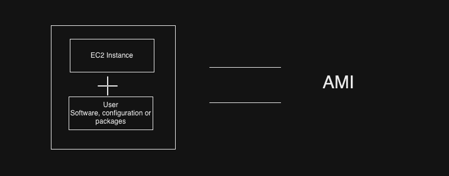
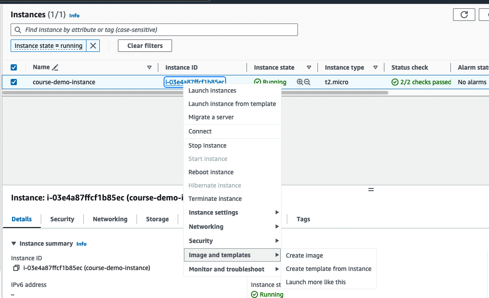

# EC2 - Elastic Cloud Compute

## [EC2 Basics](https://aws.amazon.com/ec2/)
## [EC2 instance types](https://aws.amazon.com/ec2/instance-types/)
## [Security Groups](https://docs.aws.amazon.com/vpc/latest/userguide/security-groups.html)
## [Create EC2 Instance and Connect via SSH](https://hkcodeblogs.medium.com/aws-ec2-create-and-connect-to-instance-via-ssh-354a0c1909f)

## [AMI - Amazon Machine Image](https://docs.aws.amazon.com/AWSEC2/latest/UserGuide/AMIs.html)

- AMI are image of an EC2 Instance at a point of time contains software, configuration or packages

## EC2 can be launched via - 
  - AWS Provided AMI
  - User AMI
  - AWS Marketplace AMI 

## AMI Create Option
