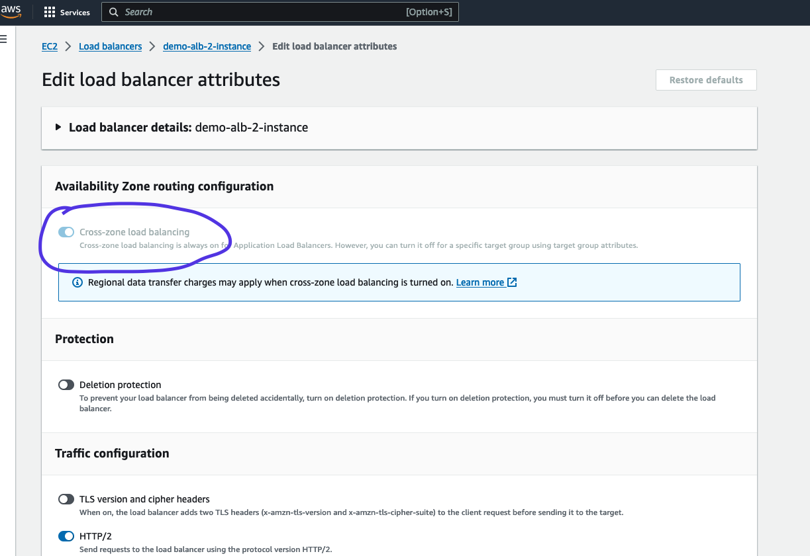

# ELB - Elastic Load Balancing

- Elastic Load Balancing (ELB) automatically distributes incoming application traffic across multiple targets (EC2 / Containers) in one or more Availability Zones (AZs). 
- [AWS Documentation](https://aws.amazon.com/elasticloadbalancing/)

    - Classic Load Balancer (Deprecated)
    - Application Load Balancer (supports HTTP, HTTPS, Websocket)
    - Network Load Balancer (supports TCP, TLS(secure TCP), UDP)
    - Gateway Load Balancer (Operates at Network Layer - layer 3, IP Protocol)

## ALB - Application Load Balancer
- Works on Layer 7 (Application Layer)
- Supports HTTP, Websocket
- Support redirects to multiple HTTP applications across target groups
- Support redirects to multiple applications on same machine

### Target Groups Can be
- Ec2 instances (can be managed by an Auto scaling group) - HTTP
- ECS Tasks (managed by ECS itself) - HTTP
- Lambda functions - HTTP request is translated into a JSON Event
- IP Addresses - must be private IPs 

###  ALB - Routing Table to different target group
- based on url path -> ex:  mydomain.com/resource1 & mydomain.com/resource2
- based on hostname in url -> ex: mydomain1/com & mydomain2.com
- based on querystring, headers -> ex: mydomain.com?id=1 & mydomain.com?id=2

[ALB Hands on Article Medium](https://hkcodeblogs.medium.com/scaling-with-aws-1-application-load-balancer-alb-b9ea2edb5f46)

## NLB - Network Load Balancer
- Operates at Layer 4 (Transport Layer)
- Used for extreme performance (handle millions of requests per second)
- Forward/Handles TCP/UDP traffic to your instances

## GWLB - Gateway Load Balancer
- Operates at Layer 3 (Network Layer) - IP Packets
- Single Entry/Exit for all traffic
- Can implement Firewalls, intrusion detection, deep packet inspection, payload manipulation etc.
- Perform functions of Gateway and Load Balancer
- uses GENEVE protocol at port 6081

## Sticky Session 
- Ensures that client is always redirected to same instance
- Can be implemented using any type of load balancer mentioned above.
- Cookie (with expiration control) is used for this purpose
- Can be Application based cookie (custom or load balancer generated) or Duration based cookie
- Below images explain how to implement sticky session in AWS

    - 
    - 

## Cross Zone Load Balancing
- Data is distributed evenly by combining all instances over multiple availability zones

## ASG - Auto Scaling Group
- Auto scale EC2 instances based on Load
- New instances can be launched automatically using launch template by ASG
- https://docs.aws.amazon.com/autoscaling/ec2/userguide/auto-scaling-groups.html

##
## Some Points
- When using an Application Load Balancer to distribute traffic to your EC2 instances, the IP address you'll receive requests from will be the ALB's private IP addresses. To get the client's IP address, ALB adds an additional header called X-Forwarded-For contains the client's IP address.

- When you enable ELB Health Checks, your ELB won't send traffic to unhealthy (crashed) EC2 instances.

- Network Load Balancer provides the highest performance and lowest latency if your application needs it.

- ALBs can route traffic to different Target Groups based on URL Path, Hostname, HTTP Headers, and Query Strings.

- Network Load Balancer has one static IP address per AZ and you can attach an Elastic IP address to it. Application Load Balancers and Classic Load Balancers as a static DNS name.

- The following cookie names are reserved by the ELB (AWSALB, AWSALBAPP, AWSALBTG).

- Server Name Indication (SNI) : SNI in Application Load Balancers and Network Load Balancers allows you to load multiple SSL certificates on one listener

- Server Name Indication (SNI) allows you to expose multiple HTTPS applications each with its own SSL certificate on the same listener. Read more here: https://aws.amazon.com/blogs/aws/new-application-load-balancer-sni/

- For each Auto Scaling Group, there's a Cooldown Period after each scaling activity. In this period, the ASG doesn't launch or terminate EC2 instances. This gives time to metrics to stabilize. The default value for the Cooldown Period is 300 seconds (5 minutes).