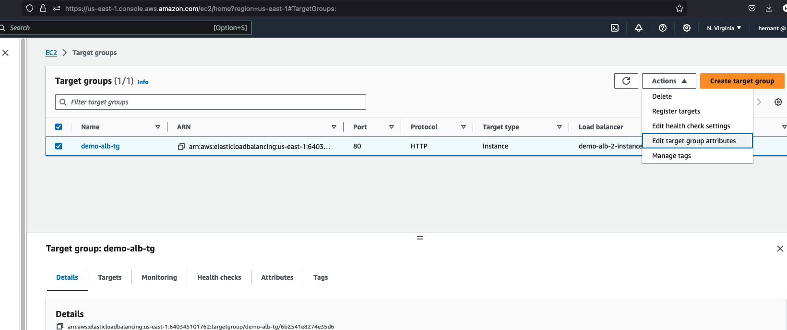
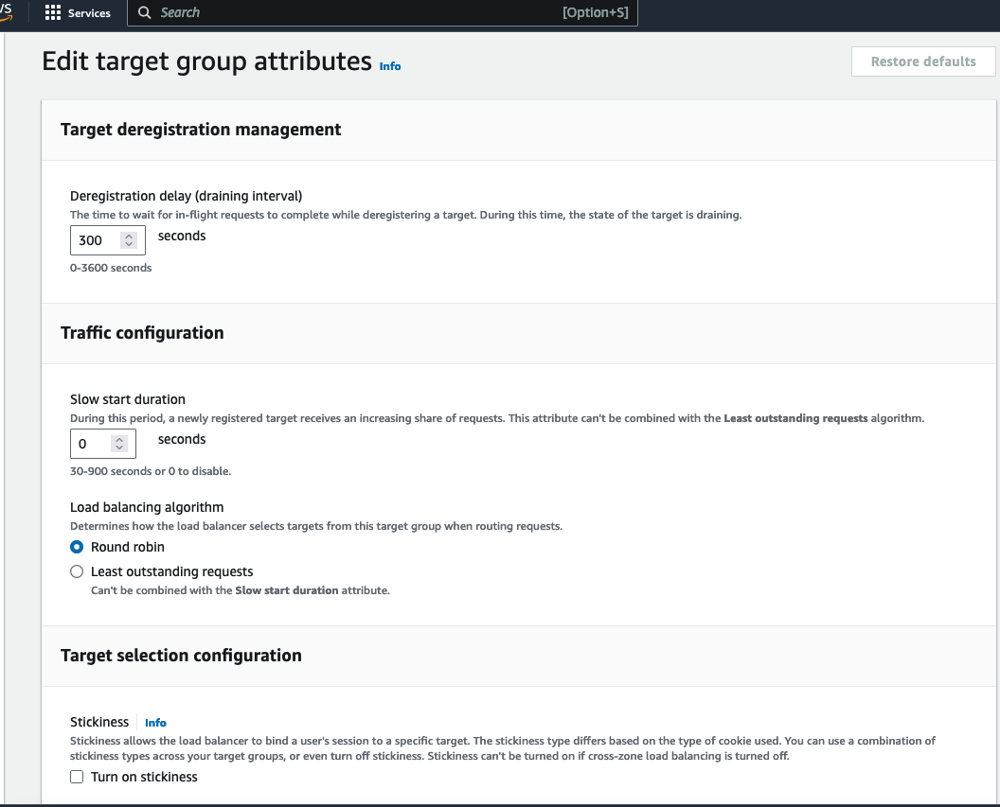

# ELB - Elastic Load Balancing

- Elastic Load Balancing (ELB) automatically distributes incoming application traffic across multiple targets (EC2 / Containers) in one or more Availability Zones (AZs). 
- [AWS Documentation](https://aws.amazon.com/elasticloadbalancing/)

    - Classic Load Balancer (Deprecated)
    - Application Load Balancer (supports HTTP, HTTPS, Websocket)
    - Network Load Balancer (supports TCP, TLS(secure TCP), UDP)
    - Gateway Load Balancer (Operates at Network Layer - layer 3, IP Protocol)

## ALB - Application Load Balancer
- Works on Layer 7 (Application Layer)
- Supports HTTP, Websocket
- Support redirects to multiple HTTP applications across target groups
- Support redirects to multiple applications on same machine

### Target Groups Can be
- Ec2 instances (can be managed by an Auto scaling group) - HTTP
- ECS Tasks (managed by ECS itself) - HTTP
- Lambda functions - HTTP request is translated into a JSON Event
- IP Addresses - must be private IPs 

###  ALB - Routing Table to different target group
- based on url path -> ex:  mydomain.com/resource1 & mydomain.com/resource2
- based on hostname in url -> ex: mydomain1/com & mydomain2.com
- based on querystring, headers -> ex: mydomain.com?id=1 & mydomain.com?id=2

[ALB Hands on Article Medium](https://hkcodeblogs.medium.com/scaling-with-aws-1-application-load-balancer-alb-b9ea2edb5f46)

## NLB - Network Load Balancer
- Operates at Layer 4 (Transport Layer)
- Used for extreme performance (handle millions of requests per second)
- Forward/Handles TCP/UDP traffic to your instances

## GWLB - Gateway Load Balancer
- Operates at Layer 3 (Network Layer) - IP Packets
- Single Entry/Exit for all traffic
- Can implement Firewalls, intrusion detection, deep packet inspection, payload manipulation etc.
- Perform functions of Gateway and Load Balancer
- uses GENEVE protocol at port 6081

## Sticky Session 
- Can be implemented using any type of load balancer mentioned above.
- It is same client is always redirected to same instance
- Cookie (with expiration control) is used for this purpose
- Can be Application based cookie (custom or load balancer generated) or Duration based cookie
- Below images explain how to implement sticky session in AWS

    - 
    - 