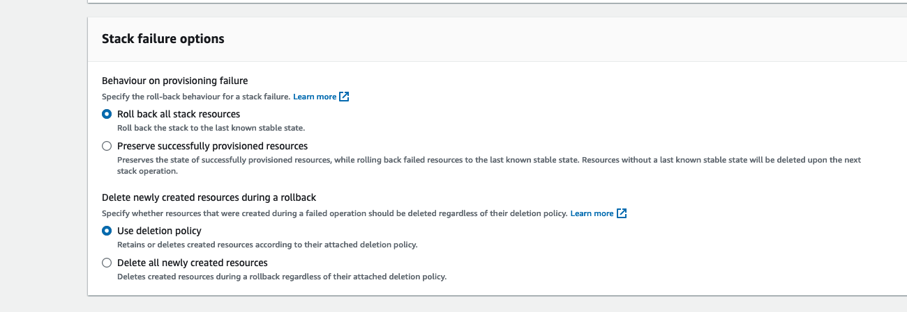
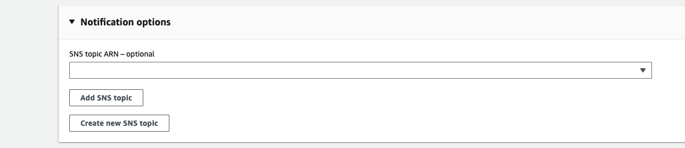

# [CloudFormation](https://aws.amazon.com/cloudformation/)

- AWS CloudFormation lets you model, provision, and manage AWS and third-party resources by treating infrastructure as code. 
- It is declarative way of outlining aws resources to be created, updated or destroyed

## Problem with Manual work
- Tough to reproduce exact resources in another region or another aws account
- Tough to reproduce exact resources in same region or aws account if resources are deleted

## Benefits
- Infrastructure as Code
  - Cloud Formation creates resources in the right order with exact configuration
  - Resource don't need to be created manually so easy to control
  - Code can be version controlled using git
- Cost
  - Each resources within stack is tagged with an identifier so you can track the cost of an stack
  - Cost can be estimated using CloudFormation Template
  - Save cost : Automatic delete all resources when not needed and create them when required
- Productivity
  - Ability to destroy and re-create an infrastructure in the cloud on the fly
  - Automate generation of diagram for your templates
  - Declarative programming
- Separation of Concern: Create many stack for many apps, and many layers. Ex - 
  - VPC Stack
  - Network Stack
  - App Stack
- Don't reinvent the wheel

## How CloudFormation Works
- Templates have to be uploaded in S3 and then referenced in CloudFormation
- To update a template create a new version, we can't edit previous one.
- Stacks are identified by name
- Delete a stack deletes all artifacts created by cloudformation using that stack

## CloudFormation Templates
- Can be prepated using JSON or YAML
- Deploying
  - Manual Way
    - Editing templates in CloudFormation Designer
    - Using the console to input parameters, etc
  - Automatic Way (__Recommended way__)
    - Editing templates in a YAML File
    - Using the AWS CLI(Command Line Interface) to deploy templates
 - Sample Templates
    - [Link 1- AWS site](https://aws.amazon.com/cloudformation/resources/templates/)
    - [Link 2- git-repo](https://github.com/awslabs/aws-cloudformation-templates/tree/master)
## CloudFormation Templates Components
  - __Resources__ (Mandatory)
    - Different AWS Components that will be created
    - Resources are declared and can reference each other
    - There are 224 [resources](https://docs.aws.amazon.com/AWSCloudFormation/latest/UserGuide/aws-template-resource-type-ref.html) types in AWS 
  - __Parameters__
    - Paramters are a way to provide input to CloudFormation Template
    - Parameters can be references using function Fn::Ref
    - Parameters can be used anywhere in template
    - Shorthand for reference in YAML is !Ref
    - Pseudo Parameters - provided by AWS to use in any CloudFormation Template
    - Pseudo Parameters example - AWS::AcountId, AWS::Region, AWS::StackId, AWS::StackName
    - Pseudo Paramter Use in YAML Example - ``` Region: !Ref "AWS::Region" ```
  - __Mappings__
    - Mappings are fixed values inside your CloudFormation Template
    - All values are harcoded within Template
    - Format
    ```yaml
    Mappings:
      Mapping01:
        key01:
          Name: value01
        key02:
          Name: value02
    ```
    - Example 
    ```yaml
    Mappings:
      RegionMap:
        us-east-1:
          "32": "ami-xxx1"
          "64": "ami-xxx2"
        us-west-2:
          "32": "ami-xxx1"
          "64": "ami-xxx2"
    ```
    - Accessing Mapping Values
      - Function Fn::FindInMap is used
      - shorthand in YAML ```!FindInMap [MapName, TopLevelKey, SecondLevelKey]```
  - __Output__
    - This section declares values that we can import in another stack
    - Outputs can be viewed using AWS Console or AWS CLI
    - Best way to perform collaboration cross stack, so you can let experts handle their own part of stack
    - Stack can't be deleted if output is referenced by another stack
    - Can be exported using Export block :
    ```yaml
    Outputs:
      SSHSecurityGroup:
        Description: Custom Group for EC2 SSH
        Value: !Ref BaseSSHSecurityGroup
        Export:
          Name: OutputSSHSecurityGroup
    ```
    - Can be imported using function Fn::ImportValue :
    ```yaml
    Resources:
      MyEC2Instance1:
        Type: AWS::EC2::Instance
        Properties:
          AvailabilityZone: us-east-1a
          ImageId: ami-a4c7edb2
          InstanceType: t2.micro
        SecurityGroups:
          - !ImportValue OutputSSHSecurityGroup
    ```
  - __Condition__
    - Conditions are used to control the creation of resources or outputs based on a condition
    - Each condition can reference another condition, parameter value or mapping
    - Conditions can be defined as -
    ```yaml
    Conditions:
      CreateProdResources: !Equals [ !Ref EnvType, PROD ]
    ```
    - Functions can be 
      - Fn::And
      - Fn::Equals
      - Fn::If
      - Fn::Not
      - Fn::Or
    - Conditions can be applied to resources/outputs etc.
    - Example:
    ```yaml
    Resources:
      MountPoint:
        Type: "AWS::EC2::VolumeAttachment"
        Condition: CreateProdResources
    ```
  - [__Intrinsic Functions__](https://docs.aws.amazon.com/AWSCloudFormation/latest/UserGuide/intrinsic-function-reference.html)
    - Fn::Ref (!Ref) -> Function used to reference
      - Parameters -> returns the value of parameter
      - Resources -> return the id of resources
      - [Example](https://docs.aws.amazon.com/AWSCloudFormation/latest/UserGuide/intrinsic-function-reference-ref.html)
    - Fn::GetAtt
      - know the attributes of your resources
      - [Example](https://docs.aws.amazon.com/AWSCloudFormation/latest/UserGuide/intrinsic-function-reference-getatt.html)
      - 
      ```yaml
      Format:

      !GetAtt <resourceName>.<attribute>
      
      Example:
      
      !GetAtt MyEc2Instance1.AvailabilityZone
      ```
    - Fn::FindInMap
      - Find Value from Mappings (used above)

## [CloudFormation Rollbacks](https://docs.aws.amazon.com/AWSCloudFormation/latest/UserGuide/stack-failure-options.html)
  - We can decide rollback strategy based on these available options
  

## CloudFormation Stack Notification
  - Send Stack Events to SNS Topic 
  
## [Best Practices](https://docs.aws.amazon.com/AWSCloudFormation/latest/UserGuide/best-practices.html) 
