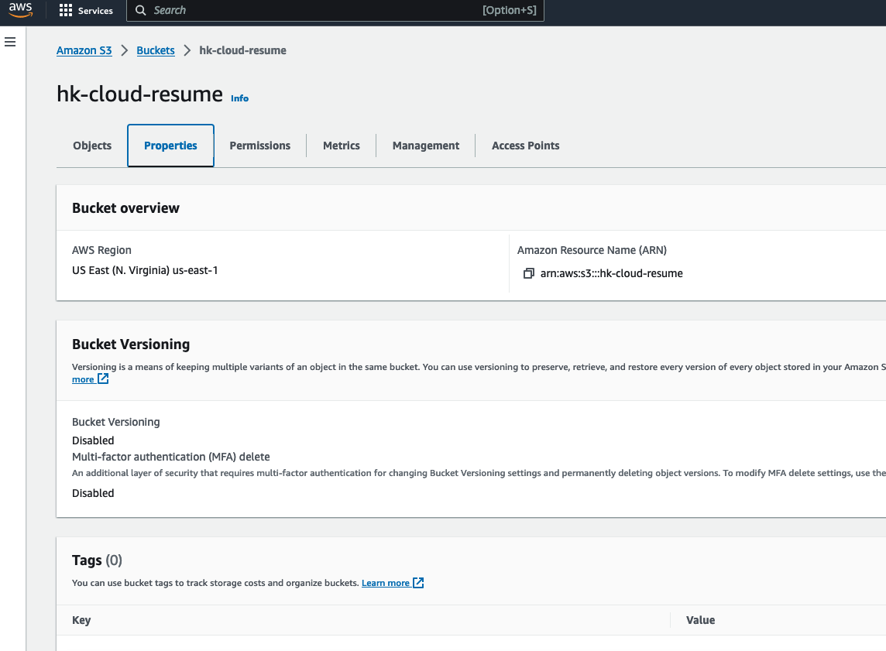

# Static Website Hosting on AWS S3

Here I will show you steps to host a resume file on AWS S3  
1. First we need a resume file in html format - [Sample Resume](https://github.com/hkcodebase/cloud-resume-aws/blob/main/web/index.html)
2. Go to main screen of S3 and create a bucket

3. Provide bucket name and region in which you want to create bucket

4. Keep other options as default, scroll all the way to end and click on create bucket

5. Select the bucket you just created

6. Now we will add resume file (index.html), Click Upload under Objects tab

7. click on Add Files

8. Select your resume file from system and click on upload

 

9. Enable Static Website option 
Click on Properties tab

Scroll all the way to down

Edit Static Website hosting and enable

10. Enable Public Access under Permissions Tab

11. Add Bucket Policy under Permissions Tab

12. Copy Url from Properties Tab

Resume is available to access in browser
